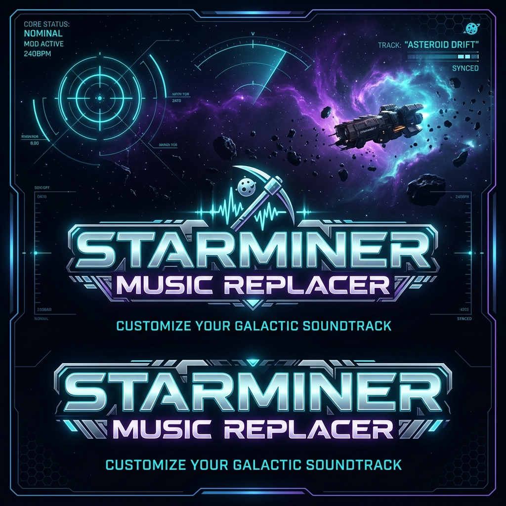

<div align="center">
  

  # 🌌 Starminer Music Replacer Mod Tool

  [](https://python.org)
  [](#)
  [](#)

  **A self-contained, out-of-the-box music replacement pipeline for Starminer.**
</div>

---

## ✨ Features

- 🎵 **Format Support**: Transcode WAV, MP3, and OGG files automatically.
- ⚙️ **Low-Level Header Patching**: Adjusts `.uexp`/`.uasset` durations, bulk data sizes, and export tables to match Starminer's unversioned property serialization.
- 📦 **100% Portable**: Comes pre-packaged with a local Unreal Engine `UnrealPak` utility and `FFmpeg` transcoder. No system installs or configurations needed!
- 🔒 **Secure Packaging**: Automatically packages staged tracks into encrypted `.pak` files (`pakchunk0-WindowsNoEditor_P.pak`) using the game's AES keys.
- 🧹 **Automatic Cleanup**: Deletes overriding loose files from the game directory to ensure the game prioritizes your custom patch pak.

---

## 🛠️ Prerequisites

1. **Python 3**: Ensure [Python 3](https://www.python.org/) is installed and added to your system PATH.
2. **Pre-packaged Binaries**: `UnrealPak.exe` (with all required DLLs and config files) and `ffmpeg.exe` are already included in the `Engine/Binaries/Win64/` directory.

---

## 🚀 Setup & Installation

1. Place the **`ModTool`** folder directly inside your main Starminer game directory (so it sits next to the game's executable `game/` directory):
   ```
   Starminer/
   ├── game/                <-- Base game directory
   └── ModTool/             <-- This directory
   ```
2. **First Run Setup**: On the first run, the tool will automatically extract required `.uasset`/`.uexp` audio templates directly from your local game files (no copyrighted files are hosted in this repository).

---

## 🎵 How To Use

### Step 1: Place your custom tracks
Put your music files inside the `InputAudio/` directory.

### Step 2: Name files to override
Rename the audio files to match the track you want to override:

| Target File Name | Description | Replaces | Original Duration |
| :--- | :--- | :--- | :--- |
| **`MainMenu`** | Main Menu Theme | `MainMenu`, `MainMenu_edit`, `illspace_theme`, `SW_Passive_Output_Remaster_SM` | 507.1s (remastered) |
| **`Adrift`** | Exploration Track | `Seagrave_-_Adrift` | 588.8s |
| **`Breathless`** | Exploration Track | `Seagrave_-_Breathless` | 576.0s |
| **`Dream_Chamber`** | Exploration Track | `Seagrave_-_Dream_Chamber` | 569.6s |
| **`Dust`** | Exploration Track | `Seagrave_-_Dust` | 576.0s |

> [!NOTE]
> You do not need to replace all tracks. For example, if you only place `MainMenu.wav` in `InputAudio/`, only the main menu music will be replaced and exploration music will remain default.

### Step 3: Run the script
Double-click and run **`run_mod.bat`**. The tool will:
- Extract original template assets (if it's the first run).
- Transcode your custom files to Ogg Vorbis.
- Patch the header metadata.
- Compile and encrypt the patch pak file.
- Clean up overriding loose files.

### Step 4: Play!
Launch **Starminer** and listen to your new tracks!
